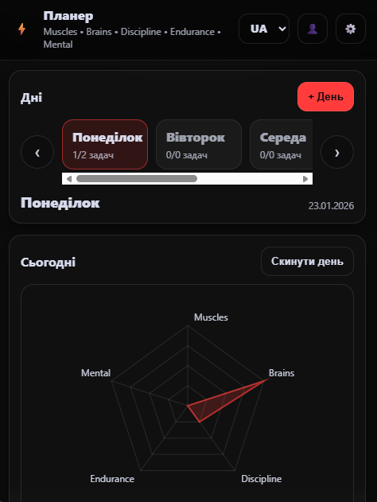
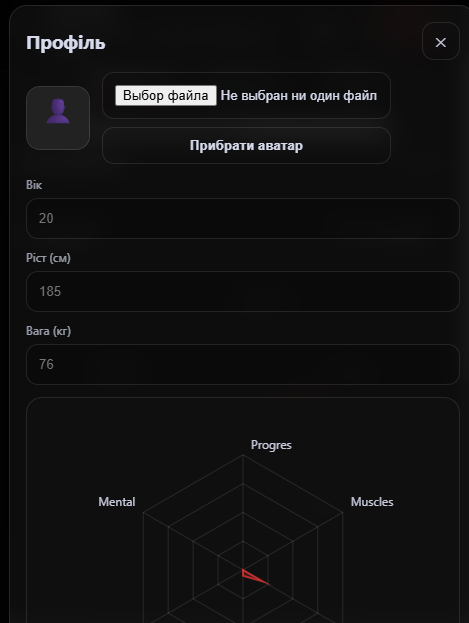
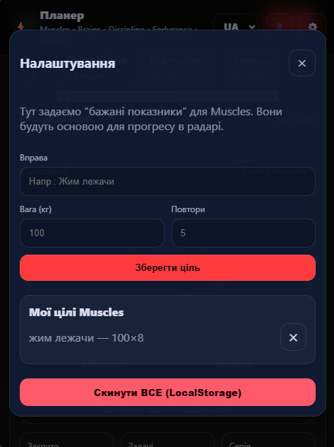

# Fitness Tracker

Personal frontend project for tracking workouts, discipline, and daily tasks.

## Features
- Workout tracking
- Discipline tracker
- Daily planner
- Radar chart statistics
- Task filtering
- Local storage support

## Technologies
- JavaScript
- HTML
- CSS

## Future Improvements
- React
- TypeScript
- Backend API
- Authentication
- Responsive design
## Screenshots

### Main screen

### Profile

### Settings

### Planner view

## Author
Danyil Polishchuk
